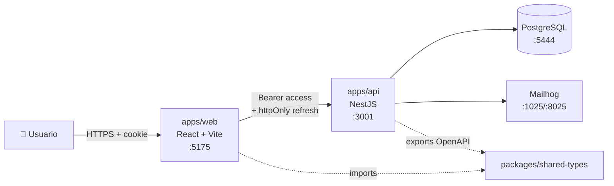
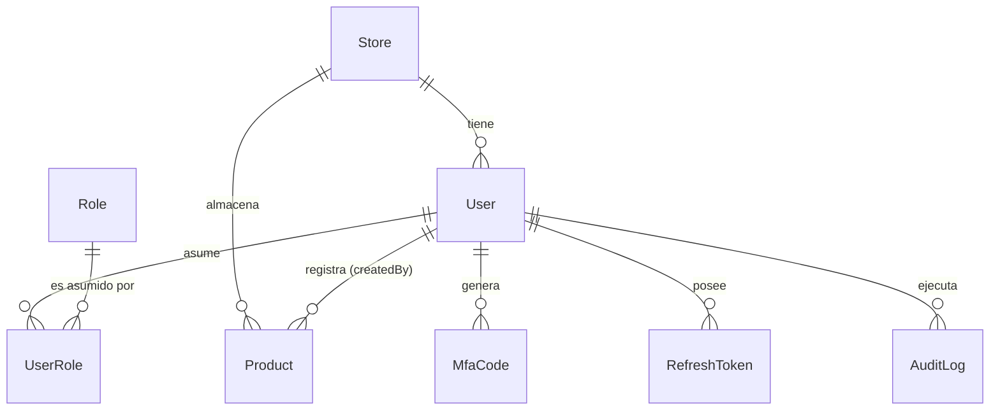
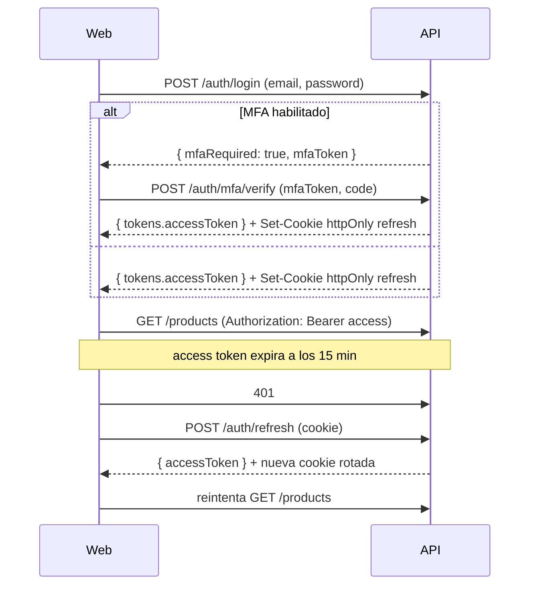

# TechStore — Inventario Multi‑tienda (Monorepo)

Sistema **full‑stack** de gestión de inventario con **NestJS + React** dentro de un monorepo `pnpm`. Implementa autenticación JWT con **MFA TOTP**, **RBAC**, **ABAC con Policy Engine**, refresh tokens en **cookie httpOnly**, auditoría y observabilidad.

```
techstore/
├── apps/
│   ├── api/             # NestJS 11 + Prisma 7 + PostgreSQL
│   └── web/             # React 18 + Vite + Tailwind + shadcn-style UI
├── packages/
│   └── shared-types/    # Tipos TS compartidos (@techstore/shared-types)
├── docker-compose.yml   # Postgres + pgAdmin + Mailhog
├── pnpm-workspace.yaml
└── package.json         # Scripts del monorepo
```

---

## Stack

### Backend (`apps/api`)
NestJS 11 · Prisma 7 (`@prisma/adapter-pg`) · Passport JWT · `bcrypt` · `speakeasy` (TOTP) · `qrcode` · Helmet · CORS whitelist · `cookie-parser` · `class-validator` + Zod (envs) · `@nestjs/swagger` · `@nestjs/throttler` · `nodemailer` (Mailhog en dev) · Jest.

### Frontend (`apps/web`)
React 18 · Vite 6 · TypeScript estricto · TanStack Query v5 · TanStack Table · React Router v6 · Zustand · React Hook Form + Zod · Axios con interceptores · Tailwind 3 + shadcn‑style + Radix UI · `lucide-react` · `sonner` · `qrcode.react` · `i18next` · Vitest + RTL + MSW · Playwright.

---

## Setup local — paso a paso

```powershell
# 1. Instalar dependencias del monorepo
pnpm install

# 2. Variables de entorno
copy apps\api\.env.example apps\api\.env
copy apps\web\.env.example apps\web\.env

# 3. Levantar Postgres + pgAdmin + Mailhog
pnpm docker:up

# 4. Migraciones + seeders
pnpm --filter @techstore/api exec prisma generate
pnpm db:migrate
pnpm db:seed

# 5. Arrancar API y Web en paralelo
pnpm dev
#   API:     http://localhost:3001
#   Swagger: http://localhost:3001/api/docs
#   Web:     http://localhost:5175
#   pgAdmin: http://localhost:5052  (admin@techstore.com / admin123)
#   Mailhog: http://localhost:8025
```

### Usuarios sembrados (password `Password!123`)

| Email | Roles | Tienda |
|---|---|---|
| `admin@techstore.com` | ADMIN | — |
| `manager.lima@techstore.com` | MANAGER | Lima |
| `employee.lima@techstore.com` | EMPLOYEE | Lima |
| `auditor@techstore.com` | AUDITOR | — |

---

## Arquitectura — diagrama C4 nivel 2



---

## Modelo de datos (ER)



Ver `apps/api/prisma/schema.prisma` para la definición completa con índices, soft delete y constraints.

---

## RBAC + ABAC — matriz para `Product`

| Acción | ADMIN | MANAGER | EMPLOYEE | AUDITOR |
|---|---|---|---|---|
| SELECT | Todos | Solo su tienda | Solo su tienda | Todos (RO) |
| INSERT | Cualquier tienda | Solo su tienda | Solo su tienda + NO premium | ❌ |
| UPDATE | Todos los campos | Su tienda, excepto `category` y `storeId` | Solo `stock` en su tienda | ❌ |
| DELETE | Cualquiera | Su tienda + NO premium | ❌ | ❌ |

**Doble validación**:
- Backend (fuente de verdad): `apps/api/src/modules/products/policies/product.policy.ts`
- Frontend (UX): `apps/web/src/shared/hooks/usePermission.ts` — espejo cliente que oculta/deshabilita controles. Si el usuario manipula el DOM, el backend lo rechaza con 403 y el interceptor de Axios muestra un toast.

---

## Auth — flujo de tokens



**Endurecimientos:**
- Bloqueo de cuenta tras 5 fallos (15 min).
- Máximo 3 intentos MFA, luego invalida `mfaToken`.
- Refresh con `revoked` flag (single‑use rotation).
- Rate limit 5 req/min en `/auth/login`.
- Mensajes de error genéricos (no se filtra si el email existe).

---

## Scripts del monorepo

| Comando | Acción |
|---|---|
| `pnpm dev` | API + Web en paralelo |
| `pnpm dev:api` / `pnpm dev:web` | Solo uno |
| `pnpm build` | Build de ambos |
| `pnpm test` | Vitest (web) + Jest (api) |
| `pnpm test:e2e` | Playwright (web) + Jest e2e (api) |
| `pnpm lint` | ESLint en ambos |
| `pnpm db:migrate` / `db:seed` / `db:studio` / `db:reset` | Prisma |
| `pnpm gen:types` | Exporta OpenAPI y genera tipos TS para el frontend |
| `pnpm docker:up` / `docker:down` | Stack Docker |

---

## Tests verificados

- **API unit (Jest)**: `product.policy.spec.ts` — 18/18 ✓ (matriz ABAC completa, whitelist UPDATE, buildReadFilter por rol).
- **Web unit (Vitest + RTL)**: `usePermission.test.ts` — 6/6 ✓ (espejo cliente del ABAC).
- **Web E2E (Playwright)**: `e2e/login.spec.ts` — login admin, credenciales inválidas, sidebar dinámico por rol.
- **Smoke real con curl** sobre la API:
  - Cookie httpOnly se setea / no aparece en body ✓
  - `/auth/refresh` rota la cookie ✓
  - `/auth/logout` limpia la cookie ✓
  - 4 escenarios ABAC del enunciado (login MFA, EMPLOYEE crea rol → 403, MANAGER actualiza precio premium su tienda → 200, EMPLOYEE delete → 403) ✓

---

## Endpoints (resumen)

### Auth
`POST /auth/register` · `POST /auth/login` · `POST /auth/mfa/verify` · `POST /auth/mfa/enable` · `POST /auth/mfa/verify-setup` · `POST /auth/refresh` · `POST /auth/logout` · `GET /auth/me`

### RBAC/ABAC
`/users` (ADMIN escritura · ADMIN+AUDITOR lectura) · `/roles` (ADMIN) · `/stores` · `/products` (ABAC) · `/audit-logs` (ADMIN+AUDITOR) · `/health` (público)

### Colección REST Client
`apps/api/requests.http` (extensión REST Client de VS Code).

---

## Variables de entorno

### `apps/api/.env`

| Variable | Default | Descripción |
|---|---|---|
| `DATABASE_URL` | — | Postgres connection string (puerto 5444) |
| `JWT_ACCESS_SECRET` | — | 32+ chars |
| `JWT_REFRESH_SECRET` | — | 32+ chars |
| `JWT_ACCESS_TTL` | `900` | segundos (15 min) |
| `JWT_REFRESH_TTL` | `604800` | segundos (7 días) |
| `BCRYPT_ROUNDS` | `12` | 10–20 |
| `MFA_ISSUER` | `TechStore` | mostrado en apps TOTP |
| `PORT` | `3001` | API |
| `CORS_ORIGINS` | `http://localhost:5175,...` | CSV |
| `SMTP_*` | — | Para futuros emails (Mailhog en dev) |

### `apps/web/.env`

| Variable | Default | Descripción |
|---|---|---|
| `VITE_API_URL` | `http://localhost:3001` | URL del backend |

---

## Seguridad implementada

- **OWASP**: validación duplicada (Zod cliente + class-validator servidor), Helmet con CSP en producción, CORS whitelist con `credentials`.
- **Auth**: bcrypt 12, JWT rotativo, refresh en cookie `httpOnly + Secure (prod) + SameSite=Lax`, bloqueo por intentos.
- **Audit**: interceptor que registra acciones sensibles, redactando campos como `password`, `mfaSecret`, `*Token`.
- **Rate limiting**: global + estricto en `/auth/login`.
- **Headers**: `helmet`, `x-correlation-id` propagado.
- **Errores**: filtro global normaliza `{ statusCode, message, error, correlationId, timestamp, path }` y oculta stack en producción.

---

## Accesibilidad y UX

- WCAG AA: labels asociados, `aria-invalid`, `aria-live`, `role="alert"`.
- Skeletons en cargas, empty states, toasts (sonner).
- Páginas 403 / 404 dedicadas.
- Modo oscuro con `ThemeProvider` (toggle en header).
- i18n preparado con `i18next` (es/en).
- Mobile‑first: sidebar colapsable.

---

## Notas Prisma 7

Prisma 7 movió la `url` del bloque `datasource` al `prisma.config.ts`. El cliente requiere un adapter:

```ts
new PrismaClient({
  adapter: new PrismaPg({ connectionString: process.env.DATABASE_URL }),
})
```
